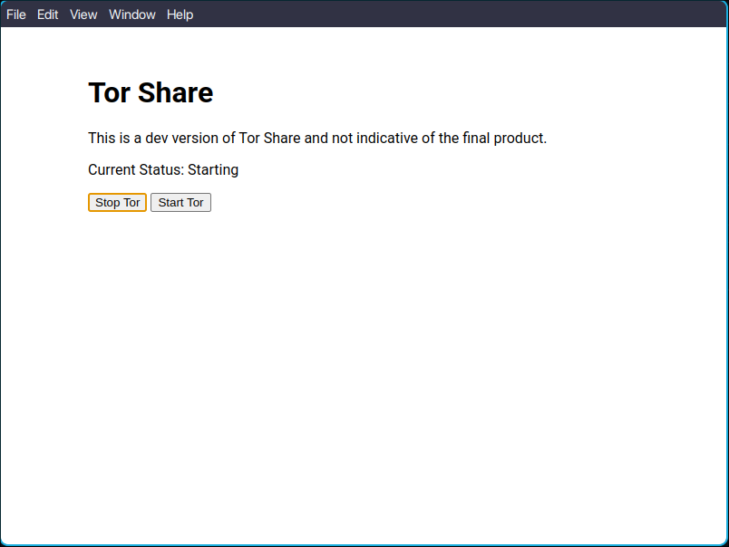

## Tor Share

### Description

Tor share is a application that allows you to share files over the Tor network

### Why

File sharing over the Tor network provides enchanced Anonymity and protects the identites of the sender and reciever

### How

This project uses a bundled Tor binary to host the tor instance.
Electron + Node for framework in pc (linux/macos/win)

## Progress

In all honestly I am only learning electron just now so the below may look very barebones
I will try to update it as the project reaches closer to completion and hopefully with every major commit

### Screenshots

